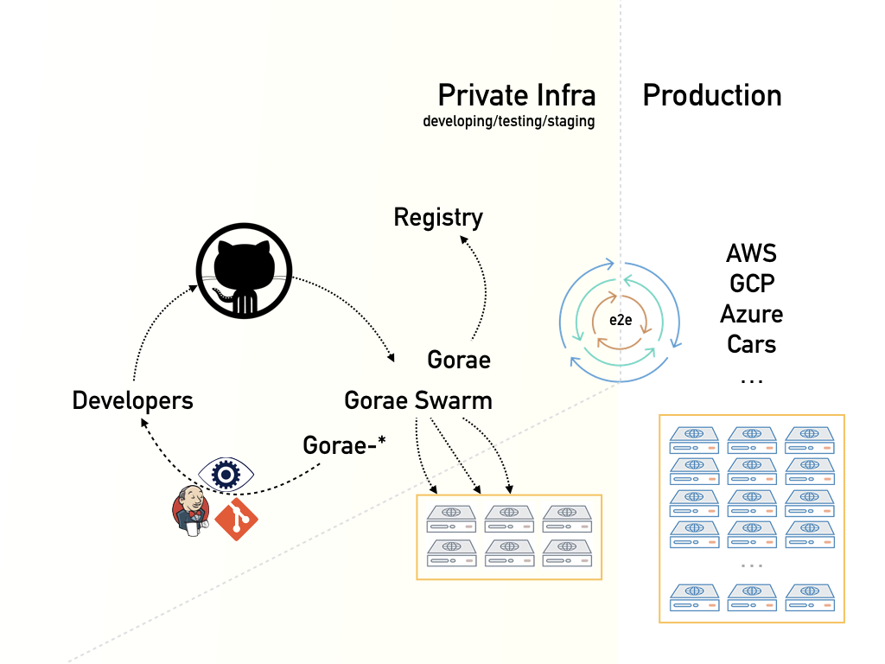
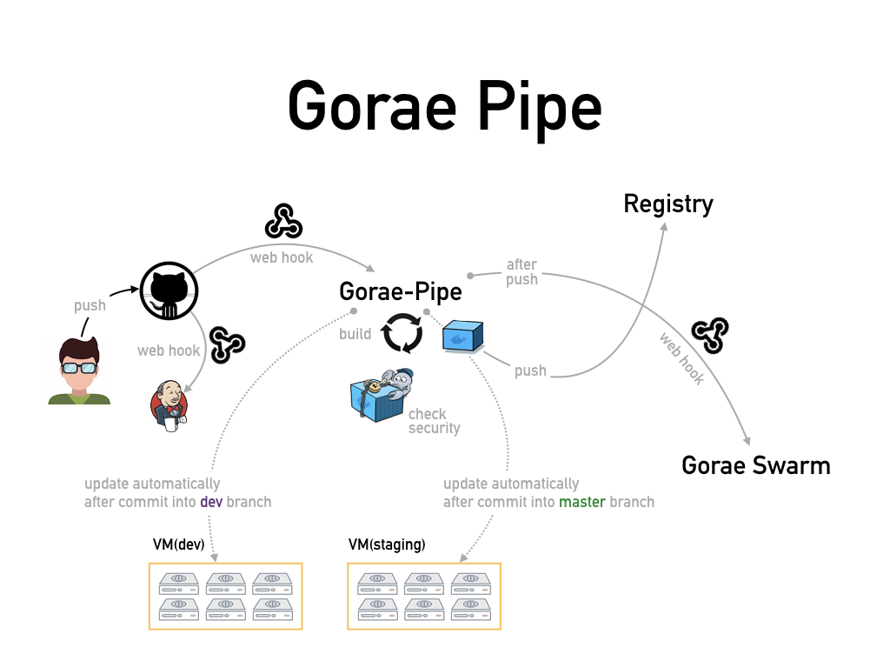

# 

The `gorae` project is web interface solution for docker related products such as DDC, DC/OS of Mesosphere using modern web technologies.

Actually, this project consists of four seperated products.

* Gorae for Docker engine
* Gorae Swarm for Orchestration and Continuous Deployment on Docker Swarm
* Gorae Registry for Docker Distribution
* Gorae Pipe for Pipeline between DVCS and Gorae Swarm (exactly Docker Swarm)

And even these are made of docker image. It means, if you want to run this project on your machine and own system. You just run `docker run` command

## Gorae Pipe

## Gorae CI/CD

### References
- https://docs.docker.com/engine/reference/api/docker_remote_api/
- http://blog.couchbase.com/2016/february/enabling-docker-remote-api-docker-machine-mac-osx
- https://github.com/apocas/dockerode
- https://github.com/CenturyLinkLabs/golang-builder
- https://forums.docker.com/t/docker-osx-var-run-docker-sock-file-missing/623
